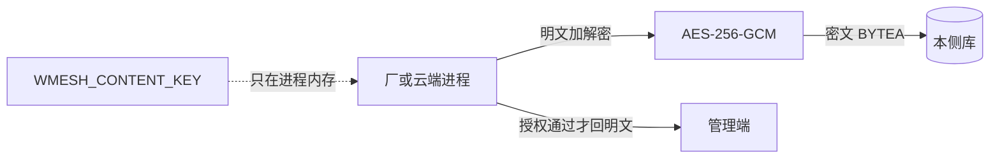

# 可复制、权限与正文加密

## 现状（为什么你会觉得「完全没有」）

服务端其实有可复制和升档拒绝（厂内 [`SetAssetCopyable`](factory/server/internal/service/asset.go)、云端升档看 [`snap.Copyable`](global/server/internal/service/asset.go)），但业务上看不见：

- 厂内「允许/禁止升档」、改名、改正文、停用仍塞在 `...` 里（[`factory/frontend/src/features/assets/AssetsPage.tsx`](factory/frontend/src/features/assets/AssetsPage.tsx)）。
- 云端页不展示可复制；平台级库约束永远是否，所以看起来像没这套语义。
- 「升厂级」按钮只给创建人，规格是：覆盖创建路径的操作员即可升档（矩阵 8.1），创建人以外的 PE 在页面上点不到。
- 正文是 Postgres 明文；库被拷走就能读参数。你已选定：**落库加密**。

保密不另做「保密级别」枚举（需求禁止另做等级换算）。谁能看正文仍按级别：个人级仅创建人；厂级按角色；平台级仅 WAN 管理员。加密解决的是「没进程密钥就读不明文」。

## 加密怎么落（密钥与数据分离）

- 两侧各写一份小底座 [`internal/platform/contentcrypt`](factory/server/internal/platform/contentcrypt) / [`global/server/internal/platform/contentcrypt`](global/server/internal/platform/contentcrypt)（互不 import）。信封：`WM1` + nonce + ciphertext。
- 密钥只进环境变量 `WMESH_CONTENT_KEY`（32 字节 hex），进进程内存，不进库、不进审计、不进升档快照。厂与 WAN **各用各的钥**，互不能解对方库。
- [`Store` 读写正文时加解密](factory/server/internal/store/asset.go)：`Insert`/`Update` 加密；读出再解密。摘要仍是 **明文 SHA-256**，升档完整性不变。
- 同样处理厂内平台级副本 [`asset_replicas`](factory/server/internal/store/closure.go)。
- 解密失败或信封坏了 → `asset integrity check failed`（当损坏，不当密钥细节抛出去）。
- 旧行无 `WM1` 前缀：当明文读，下次写入再加密（不改历史审计原文）。
- 升档通道仍走现有 WSS：厂端解密后出快照，WAN 入库再加密。通道本身已是 TLS。
- `store.Open` 带上 content key；[`config.Load`](factory/server/internal/platform/config/config.go) 校验密钥；`.env.example` 与 compose 增加该项。测试用固定测试钥。

不做：密钥轮换、按行 DEK、加密审计、加密点云。

## 可复制与权限（页面按规则露出）

厂内 [`AssetsPage.tsx`](factory/frontend/src/features/assets/AssetsPage.tsx)：

- 行上直接：**正文 / 改名 / 改正文 / 允许升档或禁止升档 / 发布 / 升厂级 / 停用**。
- **禁止升档**：有权且当前可复制即可点；发布后只能收紧。
- **允许升档**：仅草稿且当前为否。
- **升厂级**：`操作员` 且作用域覆盖创建节点（直属须整厂作用域），且可用+可复制；不再要求「必须是创建人」。
- **正文**：个人级只创建人；厂级草稿给操作员/超管；可用厂级操作员也可读。点了却 403 的按钮不画。

云端 [`AssetsPage.tsx`](global/frontend/src/features/assets/AssetsPage.tsx)：

- 增加「可复制」列，平台级固定展示 **否**。
- 升档弹窗只列厂端已过滤的可复制厂级；文案写清：升上来的新平台级不可再复制。

服务端可复制规则不改语义，只修页面与加密。`SetPlatformCopyable(true)` 继续拒绝。

## 怎么验收

- `factory/server`、`global/server`：`go test`（含：不可复制不得升档、脏密文当完整性失败、测试钥解不开生产形态）。
- 浏览器：厂内收紧可复制后不能升厂级；云端升档列表不再出现该条；库内 `content` 不再是可读明文。
